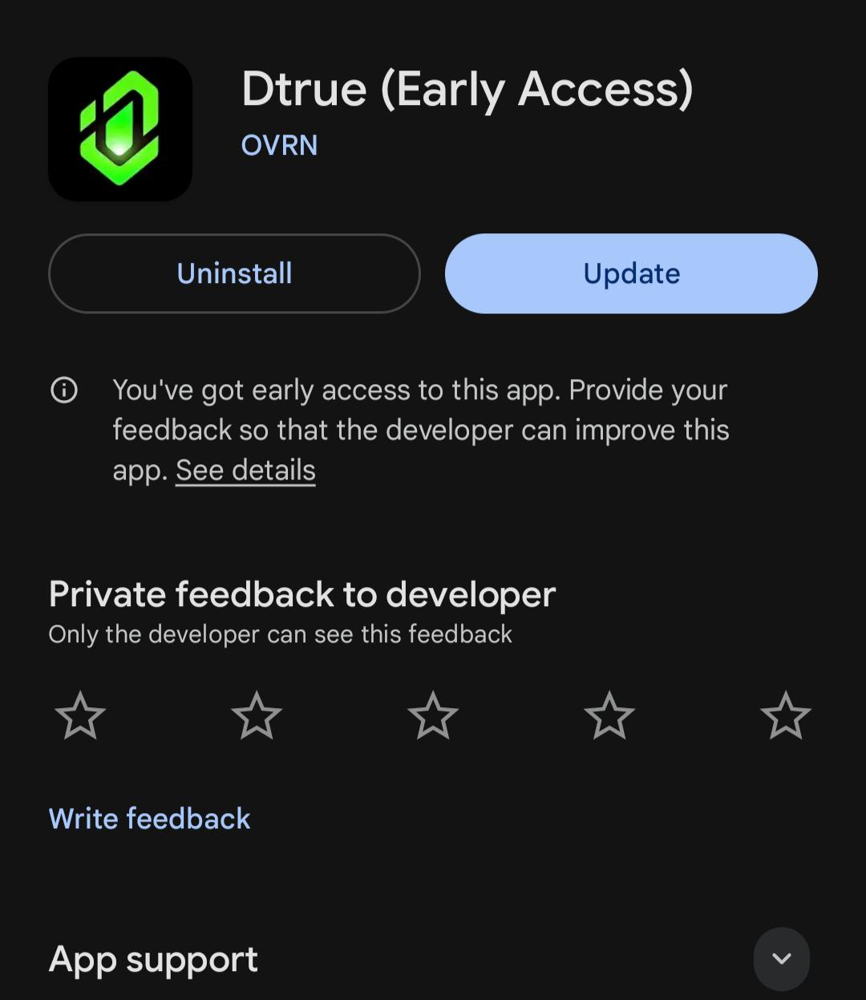

# Dtrue — Turn messy social debate into credible signal

Dtrue is a structured debate app that replaces chaotic threads with a clear flow, fast outcomes, and trustworthy summaries. Instead of rewarding volume and outrage, we elevate well‑reasoned arguments and make results easy to understand and share.

## The problem we solve

Social platforms produce noise: unstructured replies, shifting topics, popularity over quality, and no clear outcome. Good arguments get lost; readers don’t know what to trust.

## How Dtrue fixes it (end‑to‑end flow)

1) Explore debates  
   - Beautiful `DebateGrid` surfaces active and ended rooms with participants and momentum.

2) Join the room with a stance  
   - You choose agree/disagree, then write a focused opinion (no walls of replies).

3) Post a structured opinion  
   - Opinions show author, time, stance, likes, reply count, and AI signals (e.g., “AI Score”, “Flagged”).
   - Long‑press or tap to like; instant optimistic UI keeps the room responsive.

4) Get credible signal while debating  
   - Live agree/disagree percentages and timers guide towards closure, not endless back‑and‑forth.
   - Replies open in a focused, Instagram‑style sheet so discussions stay tidy and on‑topic.

5) See final results at closure  
   - Results screen shows participation stats, agreement ratio, AI‑generated summary, and ranked top opinions.
   - Share a concise outcome card; no context dump required.

## Why this beats traditional feeds

- Structure over chaos: claims with reasons and evidence, not scattered threads.  
- Outcome‑driven: timers and closure produce a result you can act on.  
- Signal first: scoring and summaries highlight the best ideas quickly.  
- Fair visibility: everyone can be heard; credibility accrues to consistently strong contributors.

## Features (shipped)

- Debate discovery via `DebateGrid` (active vs ended, joins, upvotes)
- Real‑time room with stance selection and opinion submission
- Opinion UI with likes, reply counts, author info, timestamps
- AI signals on opinions (AI Score %, AI Flagged badge)
- Ended debate results: participation overview, agreement ratio, AI‑generated summary, top opinions
- Share flow for debates and outcomes
- PostHog analytics and Sentry monitoring

## Features (designed)

- Credibility weighting for consistently high‑quality contributors
- Time‑to‑result insights across topics and communities
- Rich argument scaffolding (claims → reasons → evidence → counters)

## Security and integrity

- Transport security: all API traffic sent over TLS
- Integrity at rest: opinions are stored with cryptographic hashing to prevent tampering
- Minimal PII: only what’s needed for accounts and safety
- Abuse controls: reporting, rate limits, anomaly detection
- Auditability: stable opinion hashes enable consistency checks over time

## Tech stack

- Expo React Native + TypeScript
- Clerk authentication
- NativeWind (Tailwind) styling
- PostHog (analytics/events)
- Sentry (error monitoring)

## Status

- Closed testing now; production launch soon

### Early access

## Author

Designed and built end‑to‑end by me.

## Screenshots

Screens from the current build:

